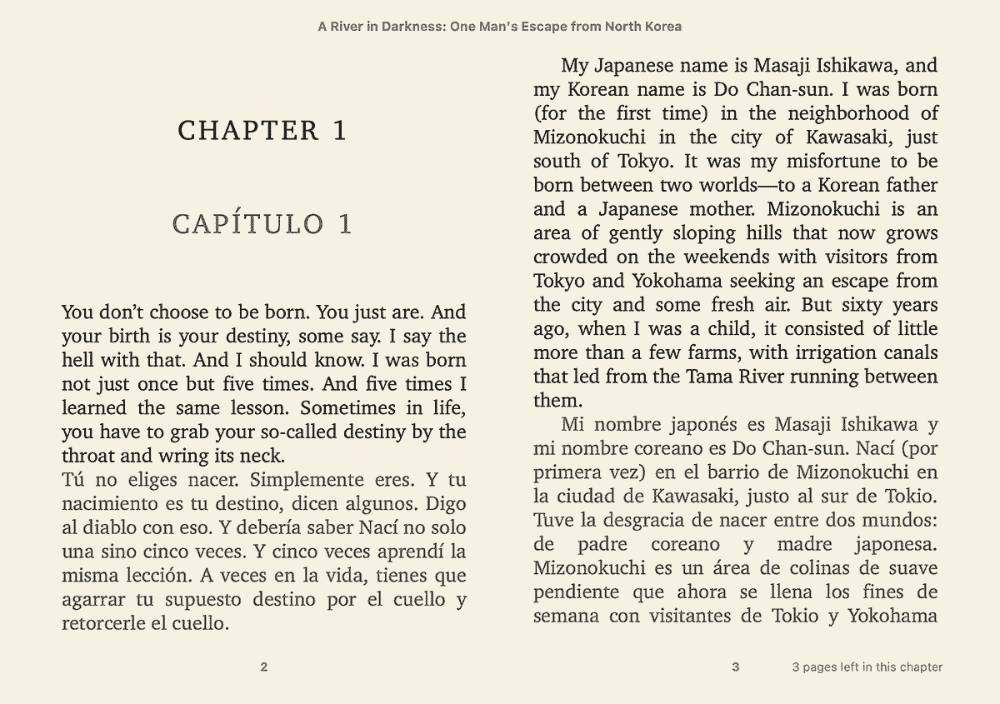

__English__ · [简体中文](README.zh-CN.md)

---

# Ebook Translator (a Calibre plugin)

A Calibre plugin to translate ebook into a specified language.

__Plugin Homepage__: [https://translator.bookfere.com](https://translator.bookfere.com)

---

## Features

* Support both "Advanced Mode" and "Batch Mode" for different usage situations.
* Support languages supported by the selected translation engine (e.g. Google Translate supports 134 languages)
* Support multiple translation engines, including Google Translate, ChatGPT, Gemini, DeepL, etc.
* Support custom translation engines (you can configure to parse response in JSON or XML format)
* Support all ebook formats supported by Calibre (48 input formats, 20 output formats), as well as additional formats such as .srt
* Support to translate more than one ebooks. The translation process of each book is carried out simultaneously without affecting one another
* Support caching translated content, with no need to re-translate after request failure or network interruption
* Provide a large number of customization settings, such as saving translated ebooks to Calibre library or designated location

---

## Manual

* [Tutorial](https://github.com/bookfere/Ebook-Translator-Calibre-Plugin/wiki#a-brief-tour)
* [Installation](https://github.com/bookfere/Ebook-Translator-Calibre-Plugin/wiki/English#installation)
* [Usage](https://github.com/bookfere/Ebook-Translator-Calibre-Plugin/wiki/English#usage)
* [Settings](https://github.com/bookfere/Ebook-Translator-Calibre-Plugin/wiki/English#settings)

---

## Links

* [GitHub ](https://github.com/bookfere/Ebook-Translator-Calibre-Plugin)
* [MobileRead](https://www.mobileread.com/forums/showthread.php?t=353052)
* [Release](https://github.com/bookfere/Ebook-Translator-Calibre-Plugin/releases)
* [Contributing](CONTRIBUTING.md)
* [Donate](https://www.paypal.com/paypalme/bookfere)

---

## License

[GNU General Public License v3.0](LICENSE)
