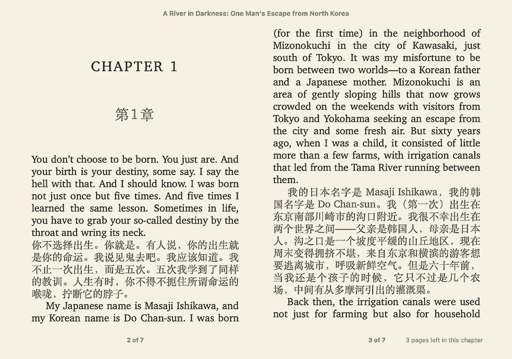

[English](https://github.com/bookfere/Ebook-Translator-Calibre-Plugin/blob/master/README.md) · __简体中文__

---

# 电子书翻译器（Calibre 插件）

一个可以将电子书翻译成指定语言（原文译文对照）的 Calibre 插件。

---

## 主要功能

* 支持所选翻译引擎所支持的语言（如 Google 翻译支持 134 种）
* 支持多种翻译引擎，包括 Google 翻译、ChatGPT 以及 DeepL
* 支持自定义翻译引擎（支持解析 JSON 和 XML 格式响应）
* 支持所有 Calibre 所支持的电子书格式（输入格式 48 种，输出格式 20 种）
* 支持批量翻译电子书，每本书的翻译过程同时进行互不影响
* 支持缓存翻译内容，在请求失败或网络中断后无需重新翻译
* 提供大量自定义设置，如将翻译的电子书存到 Calibre 书库或指定位置

---

## 用户手册

* [安装插件](https://github.com/bookfere/Ebook-Translator-Calibre-Plugin/wiki/简体中文#安装插件)
* [使用方法](https://github.com/bookfere/Ebook-Translator-Calibre-Plugin/wiki/简体中文#使用方法)
* [设置说明](https://github.com/bookfere/Ebook-Translator-Calibre-Plugin/wiki/简体中文#设置说明)

---

## 贡献指南

* [贡献指南](https://github.com/bookfere/Ebook-Translator-Calibre-Plugin/blob/master/CONTRIBUTING.md)

---

## 许可证

[GNU General Public License v3.0](https://github.com/bookfere/Ebook-Translator-Calibre-Plugin/blob/master/LICENSE)

---

* GitHub：[https://github.com/bookfere/Ebook-Translator-Calibre-Plugin](https://github.com/bookfere/Ebook-Translator-Calibre-Plugin)
* MobileRead: [https://www.mobileread.com/forums/showthread.php?t=353052](https://www.mobileread.com/forums/showthread.php?t=353052)
* 发布页面：[https://bookfere.com/post/1057.html](https://bookfere.com/post/1057.html)
* 赞赏页面：[https://bookfere.com/donate](https://bookfere.com/donate)
